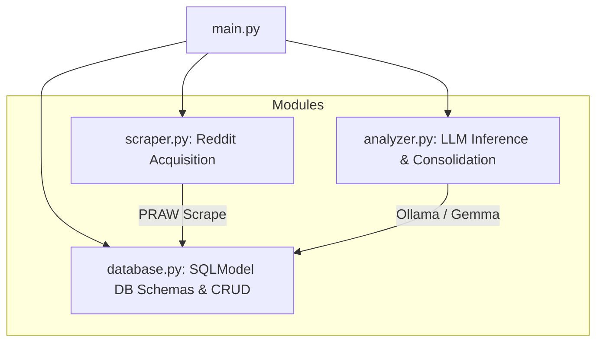
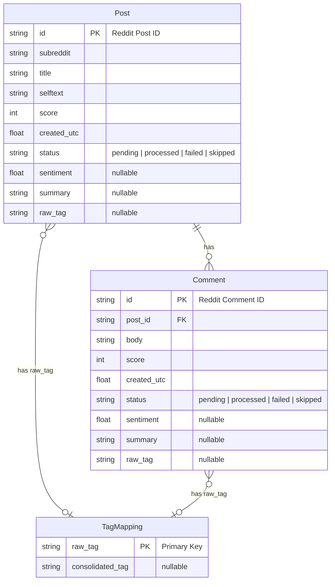

# Audience Reception Analysis Pipeline

This repository contains a modular Python data pipeline designed for qualitative and quantitative audience reception analysis of serialized television romance.

## Research Context

- **Topic**: _"When Romance Works: Understanding Audience Reception of Relationships in Serialized Television"_
- **Goal**: Analyze how television audiences perceive and react to romantic relationships by extracting sentiment, summaries, and emergent themes from Reddit discussions.

---

## System Architecture

The pipeline is split into separate, reusable modules that can be run independently or orchestrated together.

### Module Descriptions

- **`main.py`**: The central entrypoint. Supports command-line parameters (for automated scripting) and an interactive CLI wizard using `questionary` when run with no arguments.
- **`database.py`**: Defines the SQLModel database schemas and handles SQLite session connection and CRUD helper transactions (such as safe upserts). Creates the SQLite file locally at `./audience_reception.db`.
- **`scraper.py`**: Uses PRAW (Python Reddit API Wrapper) to fetch search results matching boolean query logic (e.g., `(Jake AND Amy)`) and scrape corresponding top-level comments.
- **`analyzer.py`**: Manages LLM prompting, system messages, and JSON structured output requests using the native `ollama` Python library with Pydantic schemas.
- **`util.py`**: Provides import/export capabilities (CSV/JSON) to export processed data for external statistical or qualitative tools.

---

## Database Schema & State Tracking

We use SQLite via SQLModel. The schema consists of three tables, eliminating join tables by assigning **exactly one primary tag** per item.

### Universal State System

Both `Post` and `Comment` use a `status` field to manage pipeline progress and ensure idempotency:

- **`pending`**: Scraped and stored, awaiting Stage 1 LLM inference.
- **`processed`**: Stage 1 inference completed successfully, and sentiment, summary, and raw_tag are populated.
- **`failed`**: The LLM returned unparseable output or timed out repeatedly. Kept in the DB to avoid infinite retries.
- **`skipped`**: Marked for exclusion (e.g. if the post has no body text, if a comment is too brief, or if it is filtered out as low-substance noise).

---

## Data Processing Workflow

### 1. Reddit Acquisition (`scraper.py`)

- Queries designated subreddits using Reddit's native search API. One or more subreddits can be specified via the interactive CLI wizard or script parameters (e.g. `r/television, r/relationship_advice`). If none is specified, it defaults to `r/all`.
- **Query Translation**: Since custom queries might be entered using curly braces (e.g. `{Jake AND Amy}`), the scraper automatically normalizes these to standard parenthetical expressions (e.g. `(Jake AND Amy)`) before sending them to PRAW.
- **Ordering**: Results are sorted by `top` with a time filter of `all` to capture the most representative discussions.
- **Scrape Volume**: Scrapes approximately 100 posts per query and up to 100 top-level comments per post.
- **Filtering Noise**: Automatically ignores or marks as `skipped` on scraping:
  - Comments where the body is `"[deleted]"` or `"[removed]"`
  - Comments authored by `"AutoModerator"` (or other common bots)
  - Empty items or items containing only image links.
- Persists data directly to SQLite, checking for existing IDs to avoid duplicate API calls.

### 2. Stage 1: Feature Extraction (`analyzer.py`)

- Performs LLM inference on individual posts and top-level comments marked as `pending`.
- Queries Gemma 4 E4B via Ollama to retrieve structured JSON. Enforces JSON schemas by passing a Pydantic model (`class Stage1Output(BaseModel)`) directly to Ollama's `format` option.
- Structured JSON fields:
  - **sentiment**: A discrete numeric score representing sentiment polarity, restricted to exactly: `[-1.0, -0.5, 0.0, 0.5, 1.0]` (Strongly Negative, Negative, Neutral/Mixed, Positive, Strongly Positive).
  - **summary**: A concise 1-2 sentence summarization.
  - **raw_tag**: A single primary descriptive tag (1-3 words in length, e.g., `"chemistry"`, `"pacing issues"`, `"rushed writing"`). If the content has no meaningful theme (e.g., simple memes, expressions, or low-substance content), the model returns `"Reaction Only"`.
- **Substance Check Guideline**: The LLM prompt contains a gentle guideline suggesting that if a post/comment contains less than 15 characters or lacks analytical substance, it should be categorized with `"Reaction Only"` as the tag.
- On success, updates the item's status to `processed`. On repeated failures, sets status to `failed`.

### 3. Stage 2: Thematic Clustering (`analyzer.py`)

- Queries the database for all unique `raw_tag` values from the `TagMapping` table where `consolidated_tag IS NULL`.
- Feeds the list of unique raw tags to `gemini-3-flash` (or `gemini-2.5-flash`) via the official `google-genai` Python SDK in a single request, instructing it to cluster them into a consolidated list of 10-15 broader analytical themes.
- Enforces the output schema using a Pydantic model (`class Stage2Output(BaseModel): tag_mappings: dict[str, str]`) passed directly to the `response_schema` configuration parameter.
- Updates the `consolidated_tag` column in the `TagMapping` table, allowing easy aggregation of sentiment and frequency metrics by theme.

### 4. Utilities (`util.py`)

- Facilitates data importing and exporting to CSV/JSON to aid final essay writing and graph plotting.

---

## Configuration & Setup

Environment variables will be managed using a local `.env` file loaded via `dotenv` in `main.py`:

- Reddit API credentials (`REDDIT_CLIENT_ID`, `REDDIT_CLIENT_SECRET`, `REDDIT_USER_AGENT`)
- Ollama API endpoint config (e.g. `OLLAMA_HOST` defaulting to `http://localhost:11434` and `OLLAMA_MODEL` defaulting to `gemma4:e4b`)
- Gemini API config (`GEMINI_API_KEY` and optional `GEMINI_MODEL` defaulting to `gemini-2.5-flash`)
