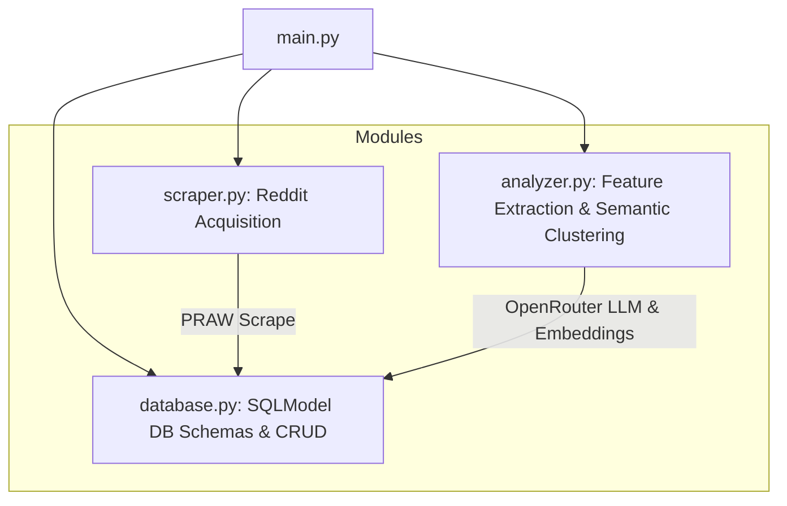
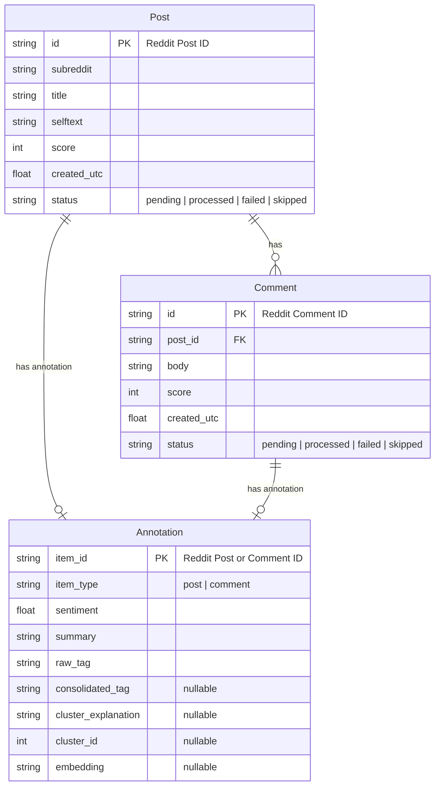

# Audience Reception Analysis Pipeline

This repository contains a modular Python data pipeline designed for qualitative and quantitative audience reception analysis of serialized television romance.

## Research Context

- **Topic**: _"When Romance Works: Understanding Audience Reception of Relationships in Serialized Television"_
- **Goal**: Analyze how television audiences perceive and react to romantic relationships by extracting sentiment, summaries, and emergent themes from Reddit discussions.

---

## System Architecture

The pipeline is split into separate, reusable modules that can be run independently or orchestrated together.

### Module Descriptions

- **`main.py`**: The central entrypoint. Supports command-line parameters and an interactive CLI wizard. Features **Workspace Selection** (to sandbox different couples into separate `.db` databases) and a **Search Query Builder** helper.
- **`database.py`**: Defines SQLModel schemas and database helpers. The SQLite filename is dynamically loaded from the environment variable `WORKSPACE_DB` (defaulting to `audience_reception.db`) to keep workspaces separated.
- **`scraper.py`**: Uses PRAW or unauthenticated JSON endpoints to fetch search results matching boolean query logic (e.g., `(Jake AND Amy)`) and scrape comments.
- **`analyzer.py`**: Manages Stage 1 LLM inference (sentiment, summaries, raw tags) and Stage 2 HDBSCAN semantic clustering.
- **`util.py`**: Provides CSV/JSON import/export utilities.

---

## Database Schema & State Tracking

We use SQLite via SQLModel. The schema consists of three tables, decoupling Reddit metadata from NLP analysis annotations and clustering states.

### Universal State System

Both `Post` and `Comment` use a `status` field to manage pipeline progress and ensure idempotency:

- **`pending`**: Scraped and stored, awaiting Stage 1 LLM inference.
- **`processed`**: Stage 1 inference completed successfully, and sentiment, summary, and raw_tag are populated.
- **`failed`**: The LLM returned unparseable output or timed out repeatedly. Kept in the DB to avoid infinite retries.
- **`skipped`**: Marked for exclusion (e.g. if the post has no body text, if a comment is too brief, or if it is filtered out as low-substance noise).

---

## Data Processing Workflow

### 1. Reddit Acquisition (`scraper.py`)

- **Acquisition Methods**: Exposes a modular, plug-and-play design supporting two methods:
  - **PRAW (Reddit API)**: Uses official credentials (`REDDIT_CLIENT_ID`, etc.) and PRAW wrapper functions.
  - **Unauthenticated JSON (API Bypass)**: Direct HTTP requests to Reddit's public `.json` endpoints (e.g., `search.json` and `comments.json`). Automatically respects rate limits by sleeping 1 second between requests.
- Queries designated subreddits using Reddit's search API. One or more subreddits can be specified via the interactive CLI wizard or script parameters (e.g. `r/television, r/relationship_advice`). If none is specified, it defaults to `r/all`.
- **Query Translation**: Since custom queries might be entered using curly braces (e.g. `{Jake AND Amy}`), the scraper automatically normalizes these to standard parenthetical expressions (e.g. `(Jake AND Amy)`) before sending them to PRAW.
- **Ordering**: Results are sorted by configurable parameters (such as `top`, `hot`, `new`, `relevance`) with a time filter (such as `all`, `year`, `month`, `week`, `day`).
- **Scrape Volume**: Scrapes 50 usable posts per query by default and up to 25 top-level comments per post. By default, acquisition keeps fetching additional search results until the saved usable posts reach the requested post limit, when enough results are available. Use `--no-fill-post-limit` to treat the post limit as the number of search candidates to try instead.
- **Filtering Noise**: Automatically ignores or marks as `skipped` on scraping:
  - Comments where the body is `"[deleted]"` or `"[removed]"`
  - Comments authored by `"AutoModerator"` (or other common bots)
  - Empty items or items containing only image links.
- Persists data directly to SQLite, checking for existing IDs to avoid duplicate API calls.

### 2. Stage 1: Feature Extraction (`analyzer.py`)

- Performs concurrent LLM inference on all posts and top-level comments marked as `pending`, with 10 concurrent OpenRouter requests by default and retry/backoff handling for transient rate-limit-like errors.
- Queries OpenRouter models (e.g. `google/gemma-4-26b-a4b-it`) to retrieve structured JSON. Enforces JSON schemas using Pydantic models.
- Structured JSON fields:
  - **sentiment**: A discrete numeric score representing sentiment polarity, restricted to exactly: `[-1.0, -0.5, 0.0, 0.5, 1.0]` (Strongly Negative, Negative, Neutral/Mixed, Positive, Strongly Positive).
  - **summary**: A concise 1-2 sentence summarization.
  - **raw_tag**: A single primary descriptive tag (typically 2-5 words, e.g., `"earned emotional payoff"`, `"forced conflict writing"`, `"chemistry through banter"`). If the content has no meaningful theme (e.g., simple memes, expressions, or low-substance content), the model returns `"Reaction Only"`.
- **Substance Check Guideline**: The LLM prompt contains a gentle guideline suggesting that if a post/comment contains less than 15 characters or lacks analytical substance, it should be categorized with `"Reaction Only"` as the tag.
- On success, updates the item's status to `processed`. On repeated failures, sets status to `failed`.

### 3. Stage 2: Thematic Clustering (`analyzer.py`)

Rather than relying on a single large LLM call to cluster tags, Stage 2 uses a hybrid semantic clustering pipeline:

1. **Embedding Generation**: Combines the raw tag and summary for each annotation and retrieves semantic embedding vectors concurrently using `sentence-transformers/all-minilm-l12-v2` via OpenRouter. Stage 2 uses 10 concurrent OpenRouter requests by default with retry/backoff handling for transient rate-limit-like errors. Generated embeddings are cached as JSON-serialized float arrays in the `Annotation.embedding` column to avoid duplicate API requests.
2. **Density-Based Clustering**: Runs `sklearn.cluster.HDBSCAN` on the normalized embedding vectors. This groups similar raw tags based on density and labels outliers as `-1` (noise).
3. **Outlier Resolution**: For points marked as noise (`-1`), calculates their cosine similarity to the computed centroid of each valid cluster. Reassigns each outlier to its closest matching cluster centroid.
4. **Cluster Labeling**: Takes the top $k$ (default 15) representative annotations closest to each cluster's centroid and sends clusters to the LLM concurrently (e.g. `google/gemma-4-26b-a4b-it`) to generate cohesive consolidated labels plus a one- or two-sentence explanation for why the label fits. Labels are cleaned to remove control characters and generic placeholders before being saved.
5. **Update**: Automatically propagates the new consolidated labels and cluster IDs to the database.

### 4. Visualizations & Analytics (`visualization.py`)

Provides rich analytical plots to explore processed data:
- **Semantic Mapping (t-SNE)**: Projects high-dimensional tag/summary embeddings to a 2D space, colored by their consolidated theme, to inspect cluster density and semantic boundaries.
- **Sentiment Score Distribution**: Shows the five discrete sentiment scores as relative grouped bars for all items, posts, and comments.
- **Sentiment Composition by Theme**: Shows each theme as a normalized stacked bar so sentiment mix can be compared across clusters.
- **Theme Dominance Bar Chart**: Compares consolidated theme volume with percentage labels for quick cluster-size comparison.
- **Theme Dominance Pareto View**: Combines theme counts with cumulative share to show whether a few clusters dominate the dataset.

Every plot supports either interactive preview windows or high-resolution PNG exports. Default export filenames include the active workspace and visualization type, such as `plots/jake_amy_semantic_map.png`.

### 5. Utilities (`util.py`)

- Facilitates data importing and exporting to CSV/JSON to aid final essay writing and graph plotting.

---

## Configuration & Setup

Environment variables will be managed using a local `.env` file loaded via `dotenv` in `main.py`. Reference `.env.example` for details:

- **Reddit API**: `REDDIT_CLIENT_ID`, `REDDIT_CLIENT_SECRET`, `REDDIT_USER_AGENT`
- **OpenRouter & LLM**: `OPENROUTER_API_KEY`, `OPENROUTER_MODEL` (e.g., `google/gemma-4-26b-a4b-it`), `OPENROUTER_MODEL_STAGE2` (defaults to `google/gemma-4-26b-a4b-it`)

### Package Management & Execution

We use `uv` for lightning-fast package management and execution:
* **Install dependencies**: `uv sync`
* **Run CLI pipeline wizard**: `uv run python main.py`
* **Run unit tests**: `uv run pytest`
